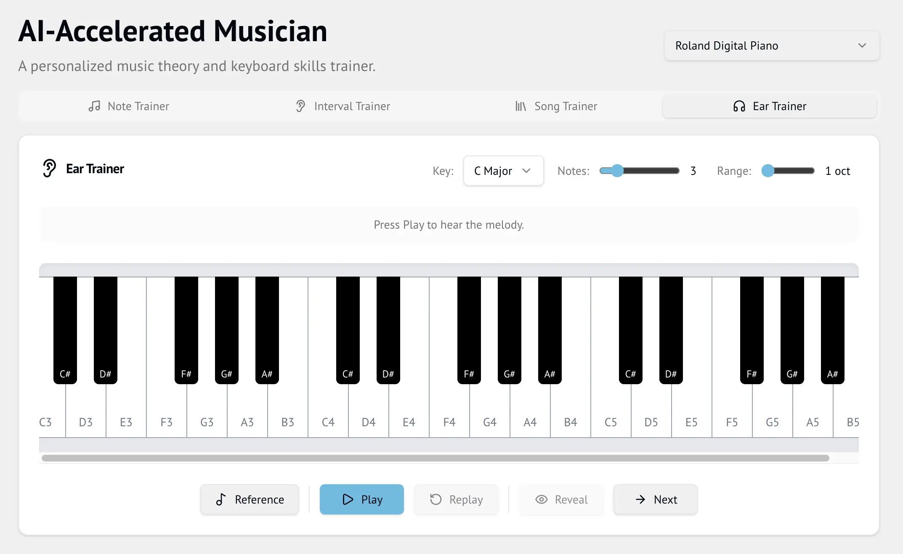

# AI-Accelerated Musician



A piano practice app with four training modes:

- **Note Trainer** — Sight-reading drill. A note appears on the staff, you play it on your MIDI keyboard. Toggle between treble clef, bass clef, or auto-switching mode.
- **Interval Trainer** — Identify musical intervals by ear.
- **Song Trainer** — Load a MusicXML file and practice with playback or wait-for-me mode. Adjustable tempo, note highlighting on the score and virtual keyboard.
- **Ear Trainer** — A short diatonic melody plays; echo it back on your MIDI keyboard. Reveals the correct sequence note-by-note with green/red feedback. Adjustable key (11 major keys), melody length (2–8 notes), and range (1 or 2 octaves).

## Audio

All trainers use real Steinway piano samples (University of Iowa Electronic Music Studios, public domain) via `Tone.Sampler`. Samples live in `public/sounds/` and are loaded once as a shared singleton.

## Getting Started

```
npm install
npm run dev
```

Open http://localhost:5173/

## MIDI

Connect a MIDI keyboard for the best experience. The app detects MIDI devices automatically via WebMidi.
